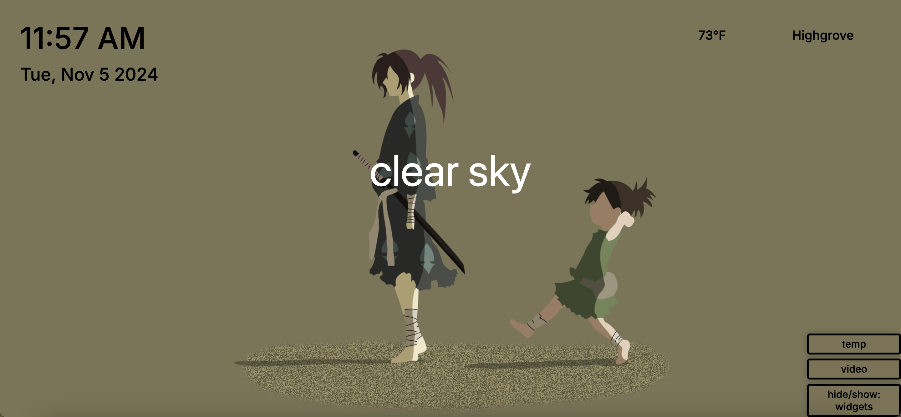

## A simple Chrome Extension with a moving background.
Implemented JavaScript to display weather information through the OpenWeatherMap API using geolocation.
Also utilizes time and date api to display the correct time and date. 

